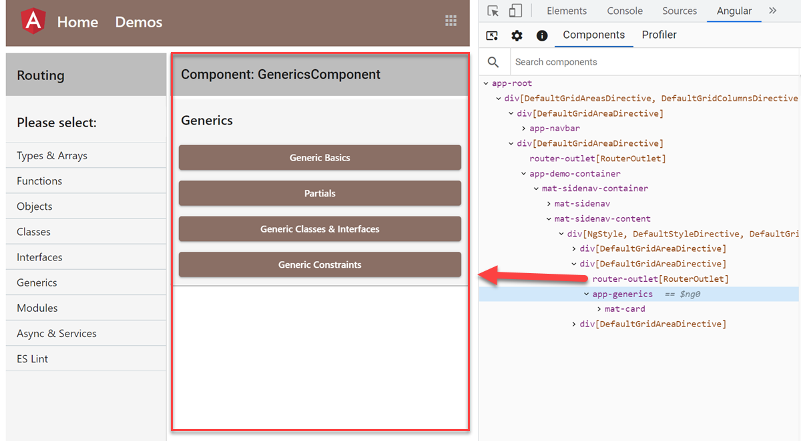

# Demos

Two types of Demos available:

- Isolated Demos located in `/app/demos/samples/<DEMOFOLDER>` of the corresponding module
- Demos build-in to the `demo-app`

The `demo-app` consists of `app.component.html` that defines the base structure and `primary router-outlet`. Subsequent routes are loaded into the outlet.

`/app/demos/demo-container/demo-container.html` defines a `left-menu` and a `nested router-outlet` where the individual isolated demos will be displayed.

## Topics covered in the class

### Angular Introduction & Setup

- What is a Single Page Application? – SPA
- Tooling: Node.js, npm and Workspace requirements
- Angular Introduction
- Angular Technology Stack
- Angular Essentials & CLI
- Debugging Angular
- Understanding Angulars Bootstrapping process and Configuration
- Updating Angular Projects
- Introduction to the Demo App

### TypeScript Fundamentals

- ECMA Script Standards
- TypeScript Overview, Configuration, Debugging, ES Lint
- Types, Arrays & Functions
- ECMA Script 6+ Essentials
- Objects, Classes, Interfaces
- 3rd Party Libraries & Type Definitions
- Async Operations, Promises & Observables

### Fundamentals & Completing Basic Tasks

- Components, Modules & Dependency Injection
- Expressions, Templates & Directives
- String Interpolation, Property- & Event-Binding, Two-Way Binding
- Pipes & Localization
- Custom Directives & Pipes
- Services & Dependency Injection

### Nesting Components

- Splitting the UI to Nested Components
- Databinding & Events with Nested Components
- Container vs Presentational Components
- Understanding Component Lifecycle
- Reusable Components using Local References & Content Projection
- View Child, View Children

### Routing & Modularity

- Routing Basics
- Working with Parameterized Routes
- Using Router State
- Child- & Secondary (Auxiliary) Routes
- Organizing Angular Applications using Modules
- Modules Types (Root, Feature, Shared, ...)
- Module Lazy Loading
- Standalone Components
- Component Less Routing
- Route Guards & Data Preloading

### Designing the User Interface

- Implementing a CSS Reset
- Global & Component Styles
- Using Sass (Synthetically Awesome Stylesheets)
- Responsive Layout using Flexbox, CSS Grid & Angular Flex Layout
- Angular Material Overview
- Using Material Component schematics
- Material Theming Colors
- Using Material Tables, Dialogs & Form Controls
- Using Angular CDK & 3rd Party Components (Charting, File Upload, Drag & Drop)

### Consuming RESTful Services

- RESTful APIs Overview
- Implementing the Client-Side Data Models
- Implementing CRUD Operations on RESTful APIs
- Using JSON Server as API for Prototyping
- Observe Response and Setting Custom Http Headers

### Forms Design & Validation

- Forms Introduction
- Template Driven Forms vs Reactive (Model Based) Forms
- Typed Forms
- Forms Builder
- FormControl, FormGroups & FormArrays
- Form Validation Basics (Snychronous / Asynchronous)
- Cross Field / Multi Field Validation
- Custom- & Code-Based Validators

### Observables & Reactive Programming

- What is Reactive Programming / Benefits
- Observable, Observer & Subject
- Creating Observables & Casting to Observables
- Using the async pipe
- Capturing Mouse & DOM Events as Observables
- Subscribing to Routes & Params, Flex Layout API
- Using Common RxJS Operators

### Managing State & Sharing Events

- What is State Management
- State Management Options
- Stateless & Stateful Services
- Sharing Data between deeply Nested Components
- Service Bus & Sharing Events between deeply Nested Components
- Visual Feedback: Implementing a Loading Indicator

### Testing Basics

- Unit Tests vs Integration Tests
- Karma & Jasmine Basics
- Test Setup & Mocking Data
- Testing Classes, Directives and Pipes
- Using Spies and Injections
- Http-Testing and HttpTestingController
- Intro to Component Testing: Testbed and Testing Module
- Component DOM Testing
- Interacting with Components in Tests
- In Short: End to End Testing using Cypress

### Securing & Publishing Angular

- Authentication / Authorization Basics in SPAs
- Token based Auth: Understanding Jwt, OAuth 2.0 & OpenID Connect
- Using Interceptors to Automate Authentication Tokens
- Securing Angular Routes using Route Guards
- Hosting Option Overview (Docker, Firebase, Azure CDN, …)
- Publishing Angular Apps