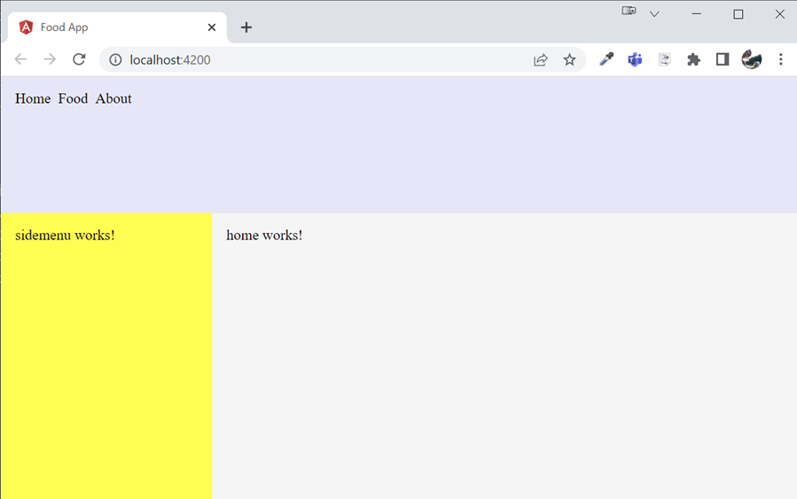

# Create a base Angular App with Layout

Make sure you have [Visual Studio Code](https://code.visualstudio.com/download), [Node 14.x](https://nodejs.org/download/release/v14.18.2/) and the lasted [Angular CLI](https://angular.io/cli) installed:

```
npm i -g @angular/cli
```

>Note: If you have problems execution scripts in PowerShell run: `Set-ExecutionPolicy bypass`. To check existing installations use: `node --version` and `npm list -g --depth 0`

Also install the [Angular Language Service - Visual Studio Code extension](https://marketplace.visualstudio.com/items?itemName=Angular.ng-template).

Create an Angular App with the following layout containing thw following components:

- home.ts
- shared/sidemenu.ts
- shared/navbar.ts



Load the menu items in the navbar using a menu.service that thakes its values from `assets/menuItems.json`:

```json
["Home", "Food", "Admin"]
```

## Step-by-Step Guide:

Create Angular Project:

```
ng new food-app-l0
cd food-app-l0
```

Add the components:

```
ng g c home
ng g c shared/sidemenu
ng g c shared/navbar
```

Notice the automatic declarations in `app.module.ts` because you have used Angular CLI: 

```typescript
@NgModule({
  declarations: [
    ...
    NavbarComponent,
    SidemenuComponent,
    HomeComponent
  ],
```

Import the css-reset from [http://meyerweb.com](https://meyerweb.com/eric/tools/css/reset/) to `styles.scss`

Add the following content to `app.component.html`:

```html
<div>
  <div class="navbar">
    <app-navbar></app-navbar>
  </div>
  <div class="mainrow">
    <div class="sidebar">
      <app-sidemenu></app-sidemenu>
    </div>
    <div class="main">
      <app-home></app-home>
    </div>
  </div>
</div>
```

Add the following styles to `app.component.scss`:

```css
.navbar{
    background-color: lavender;
    height: 150px
}

.sidebar{
    background-color: yellow;
    min-width: 200px;
}

.main{
    background-color: lightgray;
    width: calc(100vw - 200px);
}

.mainrow{
    display: flex;
    flex-direction: row;
    height: calc(100vh - 150px);
}
```

Add the menu service:

```
ng g s shared/menu
```

Add `assets/menuItems.json`:

```json
["Home", "Food", "Admin"]
```

Add `HttpClientModule` and `CommonModule` from [Frequently used Angular Modules](https://angular.io/guide/frequent-ngmodules) to `app.module.ts`:

```typescript
import { HttpClientModule } from "@angular/common/http";
...
 imports: [
    ...
    HttpClientModule
```

Inject Angular HttpClient in the constructor of `menu.service.ts` and load `assets/menuItems.json`:

```typescript
constructor(private httpClient: HttpClient) {}

getMenuItems(): Observable<string[]> {
    return this.httpClient.get<string[]>("assets/menuItems.json");
}
```

Inject menu.service in `navbar.component.ts` and get the menu items:

```typescript
constructor(private ms: MenuService) {}

navItems: string[];

ngOnInit() {
  this.ms.getMenuItems().subscribe(data => {
    this.navItems = data;
  });
}
```

Render the menu items in `navbar.component.html`:

```html
<div class="menu">
  <div class="menuItem" *ngFor="let item of navItems">{{ item }}</div>
</div>
```

Style `navbar.component.scss`:

```css
.menu{
    display: flex; 
    width: 100%;
    flex-direction: row;
    padding: 1rem;
}

.menuItem{
    margin-right: 0.5rem;
}
```