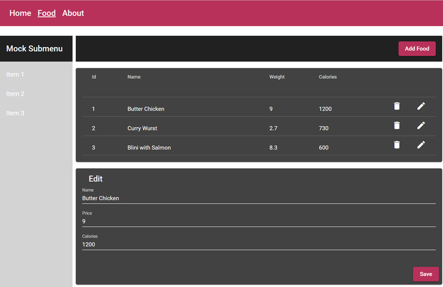

# Food App - UI

Add [Angular Material](https://material.angular.io) to your project:

- Install Angular Material using the [Material Getting Started](https://material.angular.io/guide/getting-started) and choose a theme of your choice.

- Implement a `material.module.ts` and copy its default content from the [Demo App](.../../demos/05-ui/user-interface/src/material.module.ts).

- Test the installation of Angular Material by replacing the `div` in the `navbar.component.html` with a [Material Toolbar](https://material.angular.io/components/toolbar/overview)

Implement the Base Layout using CSS Grid:

- Change to base layout in app.component to use [CSS Grid](https://css-tricks.com/snippets/css/complete-guide-grid/). Use the [Demo App](.../../demos/05-ui/user-interface/src/app/app.component.html) Layout as a reference.
    
- Hide the sidebar on devices with a horizontal width less than medium. We will add a toggle button in another lab.

Implement a Material Design for Food App:

- Use [mat-card](https://material.angular.io/components/card/overview) elemtens in `food-list.component.html` and `food-edit.component.html` to surround the content

- Use [mat-table](https://material.angular.io/components/table/overview) for the `food-list.component.html`
- Use [mat-input](https://material.angular.io/components/form-field/overview) for `food-edit.component.html`

- Use the [mat-button-directive](https://material.angular.io/components/button/examples) for the `Save`-button in `food-edit.component.html`

## Optional 

Implement a custom material theme with a [custom color palette](https://material.io/resources/color/#!/?view.left=0&view.right=0) and replace the theme that you have choosen at the beginning of this lab:

- Use the [Demo App](https://github.com/arambazamba/ng-dev/tree/main/Demos/05-UI/UserInterface/src/theme) Theme as a reference.

Add the `burger.png` file as a centered image to the `home.component.html` and use a custom [web font](https://fonts.google.com/) in the welcome text by registering it in `index.html`.

